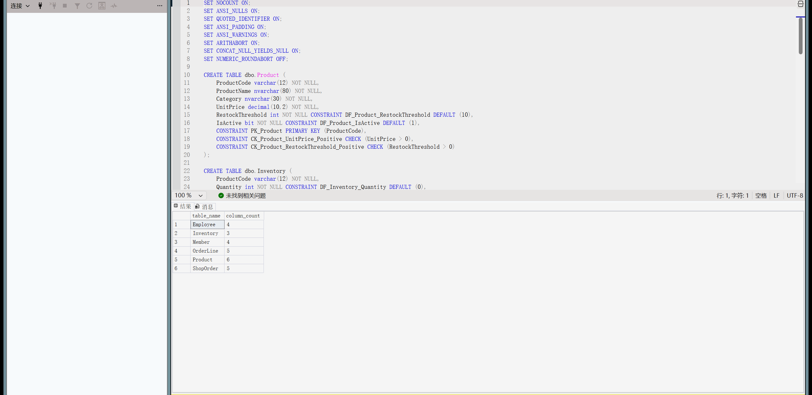
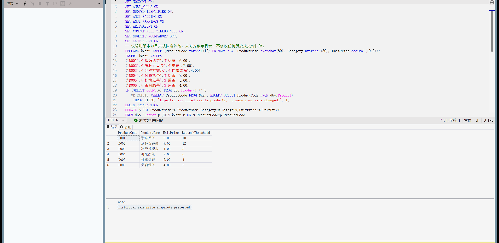
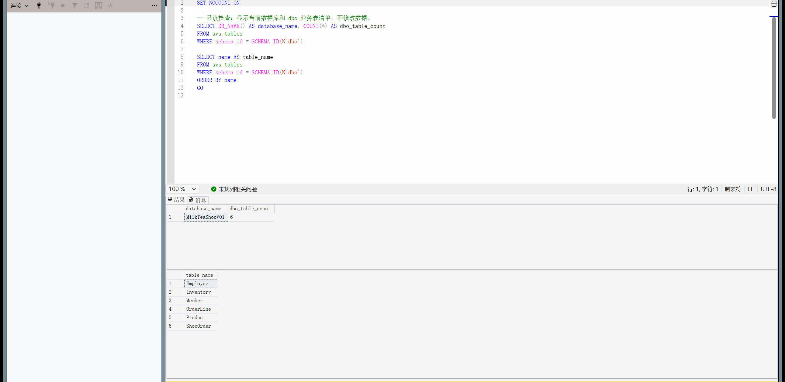

# 校园奶茶店数据库 v0.1 阶段报告

报告结构：一、设计思路；二、实验过程；三、实验总结。

## 一、设计思路

### 1.1 实验目标、经营场景与流程

本实验以校园内一家标准饮品奶茶店为场景，完成第一至第四周要求的可运行数据库原型。目标是让业务信息、表间关系、查询口径与权限边界清楚可解释，并通过实际SQL操作核对结果。

单店固定饮品，店员录入订单及明细；会员可选、匿名可购；店长维护菜单和可售杯数快照。将饮品与库存、订单头与多行明细分开。历史单价留在明细，不随菜单改价；金额即时计算，不存储可相互矛盾的冗余总额。每款饮品独立预警阈值适合备售规划，但未模拟原料、采购、自动制作、下单扣库存、积分和支付。

店员负责点单和录入，店长维护菜单、盘点快照与报表，顾客不直接连接数据库。流程为选饮品与杯数 → 选择会员或匿名 → 保存订单头和明细 → 查看完成销售 → 盘点并查看预警建议。

### 1.2 信息纳入与排除的理由

| 信息 | 是否进入数据库 | 理由 |
| --- | --- | --- |
| 饮品编码、名称、分类、当前单价、启用状态、预警阈值 | 是，Product | 稳定识别饮品，支持定价、停售和独立预警。 |
| 可售杯数、更新时间 | 是，Inventory | 记录当前盘点快照；与菜单分开，避免重复存储饮品资料。 |
| 会员编号、显示名、登记日期及可选联系方式 | 是，Member | 支持自愿登记与消费汇总，样例联系方式留空。 |
| 员工编号、显示名、岗位及启用状态 | 是，Employee | 记录订单经办人；员工资料与订单分开维护。 |
| 订单号、时间、经办员工、可选会员、完成/取消状态 | 是，ShopOrder | 描述一笔交易；匿名购买允许会员编号为空。 |
| 每行饮品、杯数、成交时单价 | 是，OrderLine | 一单可含多款饮品，保留历史价格和可核算金额。 |
| 糖冰加料、原料配方、采购、支付/退款、积分 | 暂不进入 | v0.1聚焦标准饮品关系结构与SQL操作，尚未定义这些流程的完整规则。 |
| 顾客住址、支付卡号、口令等 | 不进入 | 当前查询与课堂操作不需要这些信息。 |

糖度、冰量和加料暂不进入，是因为首版按标准饮品记录销售，尚未建立规格和加料价格规则。原料配方和采购暂不进入，是因为原料的克、毫升等计量与可售杯数不同，需要先定义配方与出入库流水。支付/退款暂不进入，是因为本阶段尚未实现付款状态和退款核算；积分暂不进入，是因为尚未确定积分获取、兑换和冲销规则。

业务步骤为选饮品和杯数、选择会员或匿名、录入订单头与多行明细、查看完成销售汇总、盘点并查看库存建议。取消单保存以便追踪但不计完成销售；盘点快照独立更新。本阶段没有将点单、支付和扣库存实现为一个结单事务。

### 1.3 表与各类码的设计理由

| 表与行粒度 | 主码/候选码 | 外码与理由 |
| --- | --- | --- |
| Product：一款标准饮品 | ProductCode | 无外码；名称和价格可能变化，编码稳定。 |
| Inventory：一款饮品的当前快照 | ProductCode | 引用Product，保证快照对应已登记饮品，且每款最多一份。 |
| Member：一位登记会员 | MemberCode | 无外码；显示名可重复；Phone允许多NULL，仅非空唯一，不是全关系候选码。 |
| Employee：一名员工 | EmployeeCode | 无外码；姓名和岗位可变，编号用于订单引用。 |
| ShopOrder：一张订单 | OrderNo | EmployeeCode引用Employee；MemberCode可空并引用Member，允许匿名购买。 |
| OrderLine：一张订单的一行饮品 | (OrderNo, LineNumber) | OrderNo引用ShopOrder，ProductCode引用Product；复合码区分同单多行，允许重复饮品。 |

以上候选码均选为主码。饮品名称和人员显示名允许重复且可能更改，不能唯一标识记录；联系方式虽对非空值唯一，但允许多个NULL，也不能标识所有会员，所以选择稳定的内部编码。明细不采用(订单号,饮品编码)作为候选码，因为同一订单允许同款饮品出现多行；(订单号,行号)才区分每一行，同一个行号又可以在不同订单中重复，因此必须使用复合主码。

将订单头与明细分开，是因为一张订单只有一个时间、经办员工和可选会员，却可以包含多款饮品；如果放在一张表，这些公共属性会在每行重复。订单与饮品之间的多对多联系由明细表分解。将菜单与库存分开，是因为菜单保存饮品定义和当前价，库存保存盘点数量和更新时间，两类信息需要独立维护。

关系基数为：一款饮品最多一份当前库存快照；一名员工可以经办多张订单；一位会员可以关联多张订单，而一张订单可以不关联会员；一张订单和一款饮品都可以对应多行明细。外码限制每个快照、订单和明细引用已存在的对象，避免孤立记录。

金额用数量乘成交价计算，避免另存行金额、订单金额后出现不一致。成交价与菜单价代表不同时间的事实。采用外键而不启用级联删除，删除时先处理明细和快照，再处理订单和饮品。

金额使用decimal(10,2)，名称使用nvarchar，数量使用整数；必需属性不允许NULL，可选会员与联系方式允许NULL；时间、阈值、状态和启用标志配置默认值。全部字段类型、长度、精度、空值、默认值、域与含义，以及每表至少三行样例，另见提交包根目录的数据字典.md。

### 1.4 完整性约束与权限设计

主码保证记录唯一，外码保证引用存在，非空、CHECK和过滤唯一索引限制属性合法值。店员只获得日常录单和报表读取权限；店长可以维护业务表并读取会员汇总。用正常操作和非法/越权操作同时核对规则。

| 类型 | 正例 | 反例与结论 |
| --- | --- | --- |
| 实体完整性 | 新编号、完整主码可以插入 | 重复订单号或同单同一行号失败，防止重复记录。 |
| 参照完整性 | 明细引用存在的订单和饮品；订单引用已有员工 | 孤儿明细或不存在的员工引用失败，防止断开的业务关联。 |
| 域与用户定义完整性 | 默认阈值、可空会员/联系方式、正数杯数符合规则 | 负库存、零菜单价、零阈值、零杯数、负成交价、非法状态及空商品名被拒绝。 |
| 条件唯一 | 多个会员联系方式为NULL允许 | 重复非空联系方式被唯一索引拒绝。 |
| 店员权限 | 读取菜单/销量、录入订单头/明细允许 | 改价、删饮品、改库存、读员工及会员资料/汇总拒绝，错误号229。 |
| 店长权限 | 修改阈值和库存、查看会员汇总允许 | 店长只获得业务表/视图权限，未授予数据库所有者权限。 |

数据库角色shop_clerk与shop_manager分别授权，再通过无登录用户course_clerk_demo与course_manager_demo执行身份切换；所有测试写入回滚。顾客不配置数据库用户，由店员代录。权限仅说明数据库授权边界，尚未实现应用登录与身份认证。

| 数据对象 | 店员读取 | 店员写入 | 店长权限 |
| --- | --- | --- | --- |
| Product、Inventory | 允许 | 不授予增改删 | 读取、增改删 |
| Member、Employee | 不授予 | 不授予 | 读取、增改删 |
| ShopOrder、OrderLine | 不授予直接读表；通过订单视图查看 | 仅INSERT，不授予UPDATE/DELETE | 读取、增改删 |
| vw_OrderDetail、vw_ProductSales、vw_InventoryStatus | 允许 | 不授予 | 读取 |
| vw_MemberConsumption | 不授予 | 不授予 | 读取 |

店员只读日常点单所需的数据，并通过视图查看订单和统计；会员联系方式与消费汇总交由店长访问。员工表的JobTitle描述业务岗位，真正执行授权的是上述数据库角色，二者不会自动关联。

## 二、实验过程

### 2.1 实验环境与样例装载

本机环境为SQL Server 2025 Express 17.0.1000.7、SQLCMD/ODBC Driver 18、SSMS 22.10.12217.157，采用Windows集成认证。SQL Server 2022尚未实测。

SQL00建库，SQL01建表，SQL02装载关联样例，SQL09设置当前菜单参考价。样例全部写在SQL中，不读取外部CSV或JSON。装载后六表计数为饮品6、库存6、会员4、员工3、订单7、明细11；每表至少三行，覆盖匿名/会员、完成/取消、零销量、零消费及库存阈值边界。

SQL00的实际返回显示新数据库已创建且状态为ONLINE，随后才能在该库内建表。

SQL01的结构查询列出六张表，表名与设计部分一致；字段与键的完整定义见SQL01和数据字典。

SQL02执行后核对每表行数，确认全部关联样例已装载，每表至少三行。

SQL09仅更新菜单目录的当前名称、分类和价格；历史明细成交价不被该语句覆盖。

### 2.2 分表CRUD与结果观察

顺序00→01→02→09→03→04→05→06→07→08→10。复现脚本逐步检查退出码，失败即停。同名库拒绝创建；新数据文件使用实例默认目录和唯一文件名。Product、Inventory、ShopOrder、OrderLine分别新增/读取/修改/删除；先删依赖明细，再删订单，先库存再饮品。试验用D999和MT-CRUD-ROLLBACK，最后回滚并断言恢复基线。

观察：商品单价2.00→2.50、阈值10→6；库存0→7；订单COMPLETED→CANCELLED→COMPLETED；明细杯数2→3，金额5.00→7.50；四类删除各1行，临时商品归零，基线产品6行。完整过程保存在SQLCMD输出，截图只是可视部分。

修改前用WHERE确认目标记录，修改后再次查询，删除时观察影响行数。截图02_crud.png、02_crud_deletes.png展示前后变化和回滚，完整输出见result/03_crud.txt。

查询新增的D999后再修改，观察菜单价2.00→2.50、预警阈值10→6以及库存0→7；这些变化证明UPDATE作用于目标记录。

饮品、库存、订单头和明细的删除各影响1行；事务回滚后临时记录归零，饮品恢复为原来的6行。窗口未显示的订单状态与明细数量结果可在03_crud.txt逐项查看。

### 2.3 业务查询与不同统计视图

七项查询覆盖多表连接、LEFT JOIN、SUM/GROUP BY、HAVING、平均价子查询、订单总额、备售建议和会员统计。四视图为vw_OrderDetail、vw_ProductSales、vw_InventoryStatus、vw_MemberConsumption。订单明细视图保留取消行供查询，销量和会员汇总只计完成单。

| 核对结果 | 实际值 |
| --- | --- |
| 完成销售（6张完成单、15杯） | 86.00元 |
| D001/D002/D003/D004销售金额 | 24/21/20/21元 |
| D005取消单、D006未售 | 完成销量均0 |
| M001/M002/M003/M004累计消费 | 40/4/10/0元 |
| HAVING≥10元 | M001、M003（包含恰好10元） |
| 高于启用菜单平均价5.50元的子查询 | D001、D002、D004 |
| D002/D003/D004建议补足杯数 | 12/11/12杯 |

会员订单数用COUNT(DISTINCT OrderNo)，避免同单多行被重复计数。多表查询、四类视图与HAVING/子查询结果分别见03_queries.png、04_views.png、09_reporting.png、10_reporting_queries.png。

多表JOIN让一条销售明细同时呈现订单、饮品和经办信息。按完成状态筛选后再聚合，取消单不会增加完成销售金额。

vw_OrderDetail用于追踪包括取消单在内的明细，vw_ProductSales按完成单汇总。两种视图服务于不同目的，所以筛选口径不同。

D002等于阈值仍预警，D003低于阈值、D004为零库存，建议杯数分别为12、11、12；会员汇总保留M004的零消费，饮品销量保留D005/D006的零销量。

HAVING累计金额≥10返回M001和恰好10元的M003；高于在售菜单平均价5.50元的子查询返回D001、D002、D004，按上表数值核算可得到相同结果。

### 2.4 合法、非法数据与角色权限验证

约束验证共13项：1个合法默认/NULL对照，12个非法反例，分别验证负库存、零菜单价、零阈值、重复订单、重复非空联系方式、孤儿明细、零数量、负成交价、非法状态、员工外键、非空商品名、重复明细主码。反例要求精确错误号和约束名，不能把任意失败当成功；最后检查临时数据清理。

权限验证12项：店员读菜单/销售、插订单头/明细成功；改价、删饮品、改库存、读员工、读会员联系方式、读店长会员报表均以229拒绝；店长维护阈值/库存、读会员报表成功。用户WITHOUT LOGIN，以EXECUTE AS验证，不授db_owner，也不为顾客提供宽泛数据库账户。

完整性结果见05_constraints.png、05_constraints_details.png及06_constraints.txt。店员/店长允许与拒绝结果见06_clerk_permissions.png及07_roles.txt。反例同时检查目标错误号、约束名和临时数据清理，不把任意失败当成测试成功。

| 实际测试 | 输入或操作 | 实际结果与结论 |
| --- | --- | --- |
| 合法默认值/NULL对照 | D998菜单价1.00；省略阈值、库存杯数、订单会员及状态 | 插入成功：默认阈值10、库存0、会员NULL、状态COMPLETED；最后回滚。 |
| 非法库存 | 为D998插入Quantity=-1 | 错误547，CK_Inventory_Quantity_Nonnegative；负库存被CHECK拒绝。 |
| 重复主码 | 再插入已存在的MT-20261001-001 | 错误2627，PK_ShopOrder；同一订单号不能重复。 |
| 条件唯一反例 | 两位临时会员填相同非空号码00000000000 | 错误2601，UX_Member_Phone_NotNull；非空值必须唯一，多NULL允许。 |
| 店员正常操作 | 读取菜单/销量，新增订单头及明细 | ALLOWED，新增各影响1行。 |
| 店员越权操作 | 改菜单价、改库存、读会员汇总 | REJECTED，错误229；未授予的操作被拒绝。 |
| 店长正常操作 | 改备售阈值、改库存、读会员汇总 | ALLOWED，更新各1行，会员报表返回4行。 |

同一轮测试同时呈现ALLOWED与REJECTED，并核对真实错误号和约束名。合法对照说明默认值与可空设计能够实际使用。

错误547对应CHECK或外码，2627对应重复主码，2601对应过滤唯一索引，515对应非空字段。13项全部符合预期，测试记录回滚清理。

结果表同时列出EffectiveUser、Outcome、RowsAffected和ErrorNumber，可以直接对照权限矩阵：店员越权均返回229，店长维护与会员报表读取成功。

### 2.5 从空库复现与最终验收

将提交包解压到独立目录，在MilkTeaShopV01不存在时按README运行复现.ps1。11步主流程全部成功，不读取父目录课件、同学材料、data文件夹或网页。SQL08返回PASS：6表、4视图、6饮品、7订单、11明细、完成销售86.00元；边界结果与回滚清理断言通过。SQL11可补充查看库存、会员、销量、HAVING及子查询结果。

成功建库、结构与装载分别见00_database_creation.png、01_schema.png、01_seed.png；最终结果见08_acceptance.png。提交包result目录包含全部15张SSMS截图和完整文本输出，README列出验收项与文件入口。

SQL10确认操作对象是MilkTeaShopV01，六表结构存在且与报告设计一致，便于复现者核对连接位置。

SQL08实际返回PASS，固定基线及匿名、取消单、零销量/零消费、阈值、回滚清理等边界断言均通过；验收依据是数据库的实际结果。

## 三、实验总结

### 3.1 完成情况

本阶段完成了需求分析、六表关系设计与数据字典、空库建库与样例装载、饮品/库存/订单及明细CRUD、多表查询与四个视图、13项完整性正反例及12项权限验证。第一至第四周内容能够从提交包重建，最终结果由固定样例和SQL断言核对。

### 3.2 设计与操作上的认识

表的划分应从一行代表什么业务事实出发。订单头与明细分开后，共同信息不必逐行重复；复合主码区分同单多行，外码保证明细有对应订单和饮品。菜单当前价与明细成交价代表不同时间的事实，因此分别保存，金额由成交价与杯数计算。

统计口径直接决定查询结果：取消单不能计入完成销售，LEFT JOIN用于保留零销量和零消费记录，订单数与杯数不能混算。阈值建议必须按每款饮品计算，而可售杯数快照不能被解释为完整原料库存流水。

正确性不仅是语句运行成功，还包括不合法的数据被目标约束拒绝、越权操作失败、允许操作成功。将测试写入回滚，可以重复演示而不污染样例；从空库顺序执行则能检查依赖、装载与脚本组合是否完整。

### 3.3 当前不足与后续改进

当前未实现原料配方、采购、自动扣库存、支付退款和应用登录，也未进行并发测试。外键不能强制完成订单至少有一条明细，后续可通过结单事务补充业务规则。扩展糖冰加料和原料管理前，应先明确实体和计量单位，再调整关系模式。

袁远冬负责需求、模式、仓库维护与整合复现；陆乐天负责字典、样例、CRUD和约束；罗金浩负责查询、视图、权限和报告。具体职责见组内分工.md；AI建议、修改决定和验证结论见ai_log.md。课堂讲解以最终SQL及实际运行结果为依据。
