# 阶段一实验报告：校园奶茶店数据库 v0.1

## 目标、环境和结果

按原始第1–4周要求完成需求分析、关系模式、数据装载、CRUD、多表查询/统计、视图、完整性和权限。已验证 SQL Server 2025 Express 17.0.1000.7、SQLCMD 18/ODBC18、SSMS22.10.12217.157，Windows集成认证。当前最终脚本已从空库顺序运行，技术验证通过。实验重点是理解关系结构、掌握SQL操作并解释返回结果。

## 第一周：需求与设计边界

单店固定饮品，店员录入订单及明细；会员可选、匿名可购；店长维护菜单和可售杯数快照。将饮品与库存、订单头与多行明细分开。历史单价留在明细，不随菜单改价；金额即时计算，不存储可相互矛盾的冗余总额。每款饮品独立预警阈值适合备售规划，但未模拟原料、采购、自动制作、下单扣库存、积分和支付。详细流程见 [需求](requirements.md)。

## 第二周：关系、域、码与样例

六表 Product、Inventory、Member、Employee、ShopOrder、OrderLine。主码分别为饮品编码、饮品编码、会员编号、员工编号、订单号、(订单号,行号)；外码连起饮品库存、员工订单、可空会员订单、订单明细和饮品明细。Phone允许多NULL，仅非空唯一，因此不是全关系候选码。所有类型、长度、精度、默认值、空值、域、选择理由和每表至少三行样例见 [字典](data-dictionary.md)。

数据包含6款饮品、6份库存、4位会员、3名员工、7张订单和11条明细。手机号不收集。固定时间令不同日期复现一致；库存快照晚于历史订单。样例涵盖完成/取消、匿名/会员、零销售/零消费、等于阈值/低于阈值/零库存。

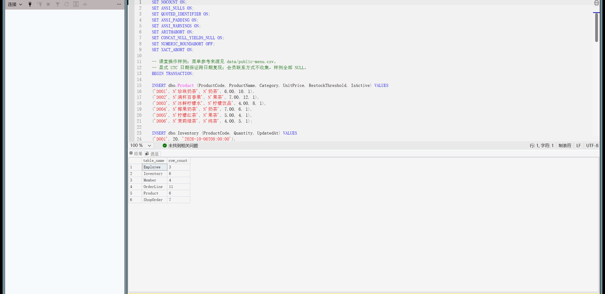

## 第三周：从空库建库和 CRUD

顺序00→01→02→09→03→04→05→06→07→08→10。复现脚本逐步检查退出码，失败即停。同名库拒绝创建；新数据文件使用实例默认目录和唯一文件名。Product、Inventory、ShopOrder、OrderLine分别新增/读取/修改/删除；先删依赖明细，再删订单，先库存再饮品。试验用D999和MT-CRUD-ROLLBACK，最后回滚并断言恢复基线。

观察：商品单价2.00→2.50、阈值10→6；库存0→7；订单COMPLETED→CANCELLED→COMPLETED；明细杯数2→3，金额5.00→7.50；四类删除各1行，临时商品归零，基线产品6行。完整过程保存在SQLCMD输出，截图只是可视部分。

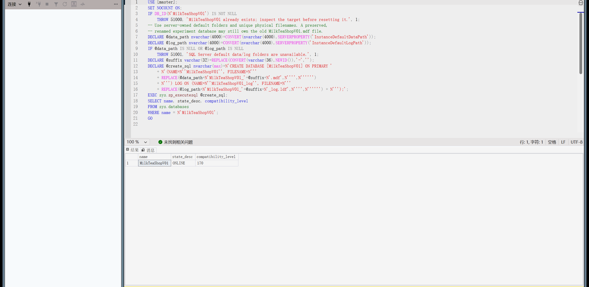

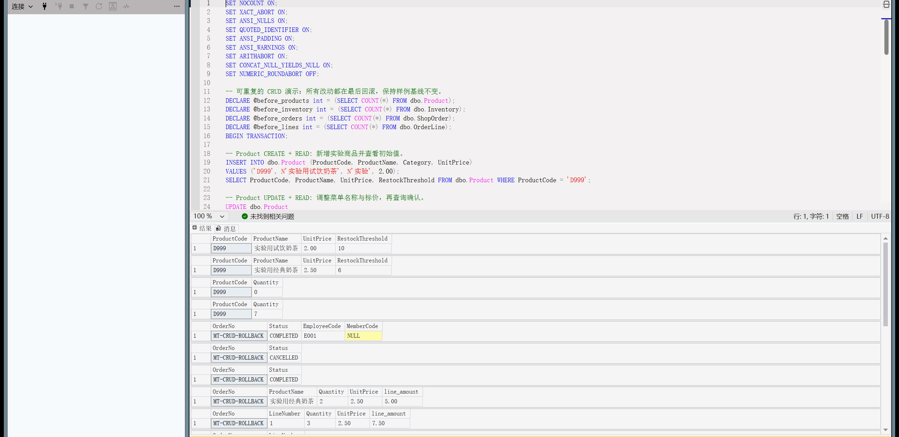

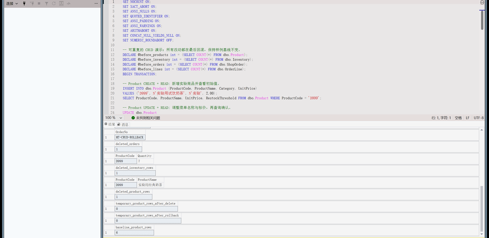

## 第四周：查询、视图、约束与权限

七项查询覆盖多表连接、LEFT JOIN、SUM/GROUP BY、HAVING、平均价子查询、订单总额、备售建议和会员统计。四视图为vw_OrderDetail、vw_ProductSales、vw_InventoryStatus、vw_MemberConsumption。订单明细视图保留取消行供查询，销量和会员汇总只计完成单。

| 核对结果 | 实际值 |
| --- | --- |
| 完成销售（6张完成单、15杯） | 86.00元 |
| D001/D002/D003/D004销售金额 | 24/21/20/21元 |
| D005取消单、D006未售 | 完成销量均0 |
| M001/M002/M003/M004累计消费 | 40/4/10/0元 |
| HAVING≥10元 | M001、M003（包含恰好10元） |
| 高于启用菜单平均价5.50元的子查询 | D001、D002、D004 |
| D002/D003/D004建议补足杯数 | 12/11/12杯 |

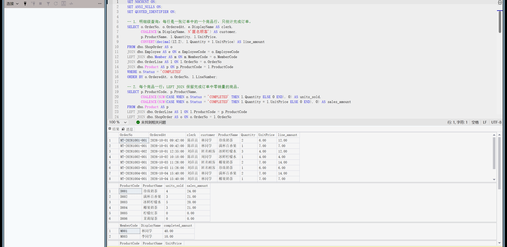

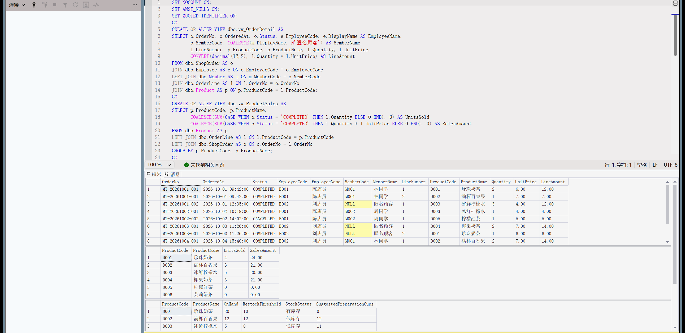

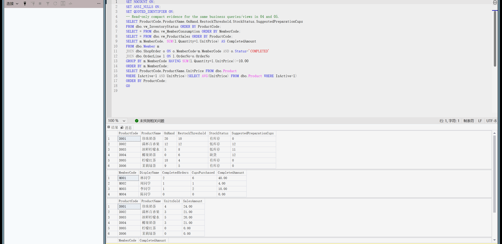

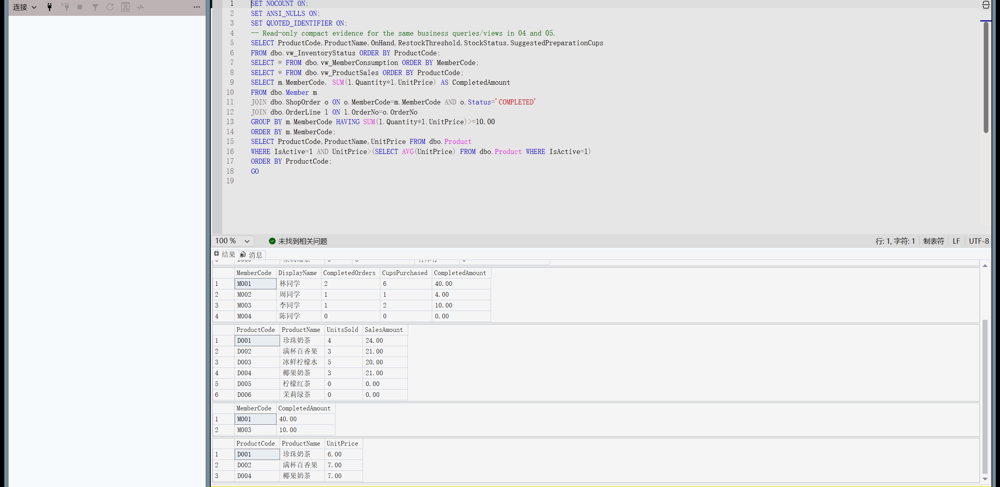

约束验证共13项：1个合法默认/NULL对照，12个非法反例，分别验证负库存、零菜单价、零阈值、重复订单、重复非空联系方式、孤儿明细、零数量、负成交价、非法状态、员工外键、非空商品名、重复明细主码。反例要求精确错误号和约束名，不能把任意失败当成功；最后检查临时数据清理。

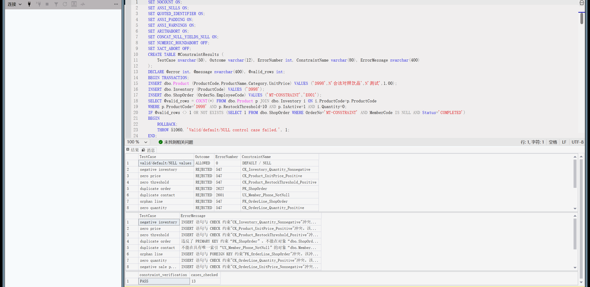

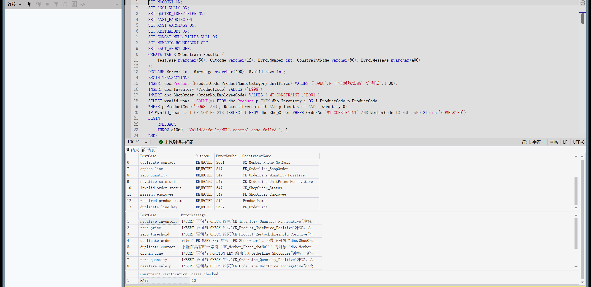

权限验证12项：店员读菜单/销售、插订单头/明细成功；改价、删饮品、改库存、读员工、读会员联系方式、读店长会员报表均以229拒绝；店长维护阈值/库存、读会员报表成功。用户WITHOUT LOGIN，以EXECUTE AS验证，不授db_owner，也不为顾客提供宽泛数据库账户。

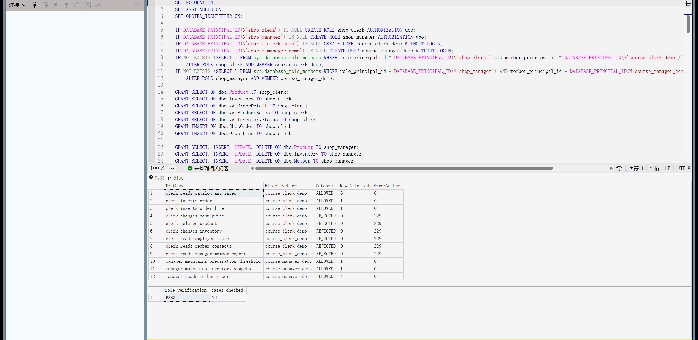

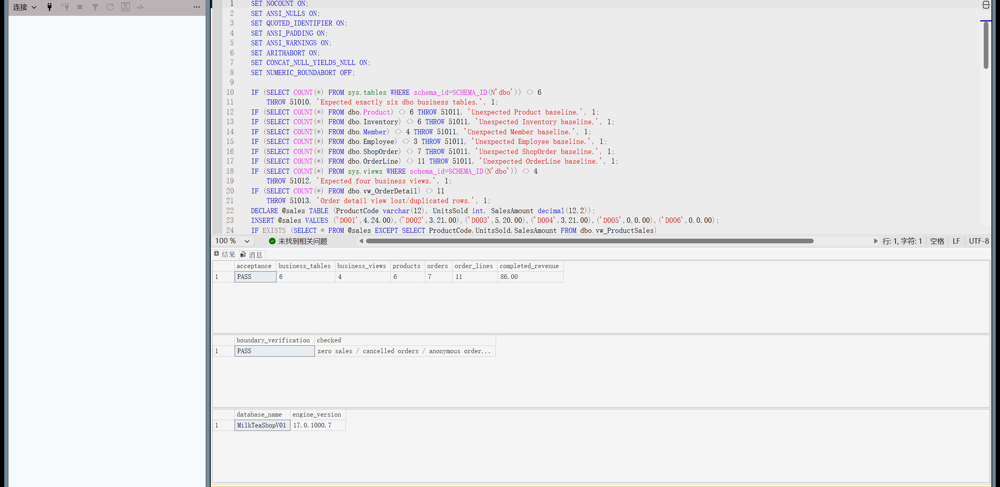

## 总结与限制

SQL12额外调用实际菜单更新脚本：菜单临时9.90→6.00时历史价保持5.00；外层回滚后基线仍86.00，输出见 `../result/13_menu_snapshot_test.txt`。

本阶段交付内容及本机技术验证已完成；贡献与借鉴见 [分工](contribution.md)，运行证据见 [执行记录](execution-notes.md)及哈希清单。当前基线6表、4视图、6饮品、7订单、11明细、86元完成销售；CRUD/反例/权限试验不留下临时数据。

SQL Server 2022尚未实测；未验证生产登录、并发、应用认证或完整结单事务。快照库存不自动扣减，外键也不能强制订单至少一条明细。SSMS截图为真实运行界面，只裁去账户窗口边缘；课堂讲解包括关系、键、聚合口径及权限边界。
